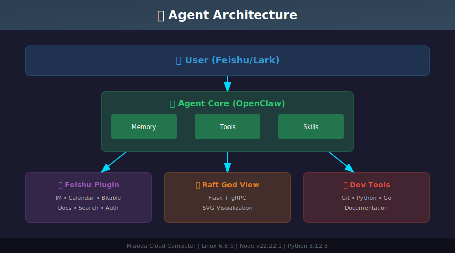

# 🫧 Raft Consensus Protocol Implementation



---

## 📖 Project Overview

This repository contains a complete implementation of the **Raft consensus protocol** for the CUHK Fall 2022 Distributed Systems course.

### What is Raft?

Raft is a consensus algorithm designed as an alternative to Paxos. It provides:
- **Leader election** with term-based voting
- **Log replication** across distributed nodes
- **Safety guarantees** ensuring consistency even during failures
- **High availability** through automatic failover



---

## 🏗️ System Architecture

```
┌─────────────────────────────────────────────────────────┐
│                    User (Feishu/Lark)                    │
└────────────────────┬────────────────────────────────────┘
                     │
                     ▼
┌─────────────────────────────────────────────────────────┐
│              Agent Core (OpenClaw + Python)              │
│  ┌──────────┐  ┌──────────┐  ┌──────────┐              │
│  │ Memory   │  │ Tools    │  │ Skills   │              │
│  └──────────┘  └──────────┘  └──────────┘              │
└────────────┬─────────────┬──────────────┬──────────────┘
             │             │              │
             ▼             ▼              ▼
    ┌────────────┐ ┌────────────┐ ┌────────────┐
    │ Feishu     │ │ Raft God   │ │ Dev Tools  │
    │ Plugin     │ │ View       │ │ Git/Go     │
    └────────────┘ └────────────┘ └────────────┘
```

---

## 🚀 Quick Start

### Prerequisites

```bash
# Python dependencies
pip install flask grpcio grpcio-tools

# Go (for compiling Raft nodes)
# Install from: https://golang.org/dl/
```

### Compile Raft Binary

```bash
cd yourCode
bash compile.sh
```

### Run the Visualization Dashboard

```bash
# Option 1: Auto mode (recommended)
python3 god_view.py

# Option 2: Manual mode
# Start nodes manually, then run:
python3 god_view.py
```

Access the dashboard at: **http://localhost:5000**

---

## 📁 Project Structure

```
go-raft/
├── yourCode/              # Your Raft implementation
│   ├── main.go           # Main entry point
│   ├── go.mod            # Go module definition
│   └── compile.sh        # Build script
├── tests/raft/           # Test cases & proto files
│   ├── raft.proto        # gRPC service definition
│   └── raft_pb2.py       # Generated Python bindings
├── god_view.py           # Visualization dashboard
├── generate_readme_svg.py # SVG generator for README
├── assets/               # Generated SVG images
│   ├── profile.svg
│   └── architecture.svg
├── bin/                  # Compiled binaries
└── README.md             # This file
```

---

## 🎯 Key Features

### 🔭 Raft God View Dashboard

A real-time visualization tool for monitoring Raft cluster state:

- **Live Node Status**: See Leader/Follower/Candidate roles
- **Term & Vote Tracking**: Monitor election progress
- **Log Replication View**: Track committed entries
- **Interactive Controls**:
  - ➕ Add new nodes dynamically
  - 💀 Kill nodes to test fault tolerance
  - 🔄 Refresh cluster state
- **Topology Visualization**: SVG-based cluster diagram

### 🛠️ Development Tools

- **Auto-compile**: One-click build script
- **gRPC Integration**: Type-safe RPC calls
- **Test Framework**: Automated test cases

---

## 📊 Raft Protocol Details

### Leader Election

1. Nodes start as **Followers**
2. If no heartbeat received within election timeout → become **Candidate**
3. Candidate requests votes from other nodes
4. Majority votes → become **Leader**
5. Leader sends heartbeats to maintain authority

### Log Replication

1. Client sends command to Leader
2. Leader appends to local log
3. Leader replicates to Followers
4. Majority acknowledgment → commit entry
5. Apply to state machine

### Safety Guarantees

- **Election Safety**: Only one Leader per term
- **Leader Append-Only**: Leader never overwrites logs
- **Log Matching**: Logs are consistent across nodes
- **State Machine Safety**: Committed entries are permanent

---

## 🧪 Testing

Run the test suite:

```bash
cd tests
python3 -m pytest raft/
```

Or use the provided test scripts in `scripts/` directory.

---

## 📝 API Reference

### gRPC Services

```protobuf
service RaftNode {
  rpc RequestVote(RequestVoteArgs) returns (RequestVoteReply);
  rpc AppendEntries(AppendEntriesArgs) returns (AppendEntriesReply);
  rpc Propose(ProposeArgs) returns (ProposeReply);
  rpc GetValue(GetValueArgs) returns (GetValueReply);
  rpc SetHeartBeatInterval(SetHeartBeatIntervalArgs) returns (SetHeartBeatIntervalReply);
  rpc SetElectionTimeout(SetElectionTimeoutArgs) returns (SetElectionTimeoutReply);
}
```

### Dashboard APIs

| Endpoint | Method | Description |
|----------|--------|-------------|
| `/api/status` | GET | Get cluster status |
| `/api/node/add` | POST | Add new node |
| `/api/node/:id/kill` | POST | Kill specific node |

---

## 🎨 SVG Generation

The README includes dynamically generated SVG visualizations:

```bash
python3 generate_readme_svg.py
```

This creates:
- `assets/profile.svg` - Agent capability overview
- `assets/architecture.svg` - System architecture diagram

---

## 📚 Resources

- [Raft Paper](https://raft.github.io/raft.pdf)
- [Raft Website](https://raft.github.io/)
- [gRPC Documentation](https://grpc.io/docs/)
- [CUHK CS4026 Course Materials](https://www.cse.cuhk.edu.hk/~cslui/CS4026.html)

---

## 👥 Credits

- **Course**: CUHK Fall 2022 Distributed Systems
- **Protocol**: Raft (Ousterhout et al.)
- **Visualization**: Flask + gRPC + SVG
- **Agent**: 🦞 user985144's Assistant

---

<div align="center">

**Status**: 🟢 Operational | **Last Updated**: 2026-03-22

Made with ❤️ by user985144's Assistant | Powered by 飞书妙搭

</div>
